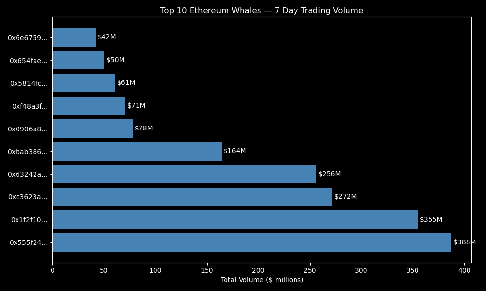
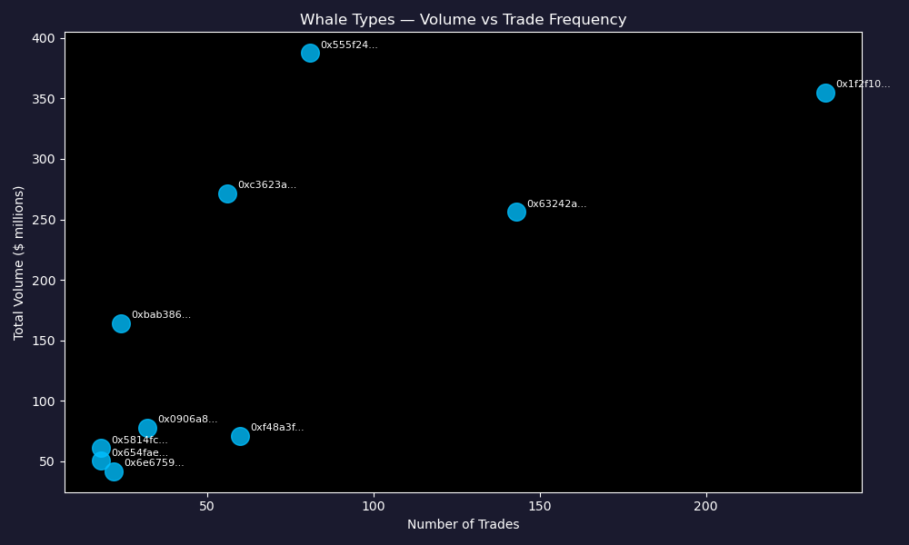
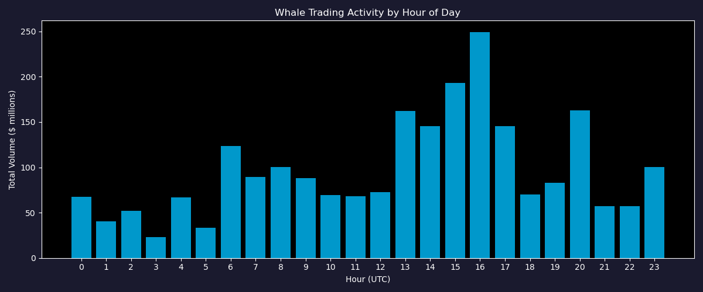
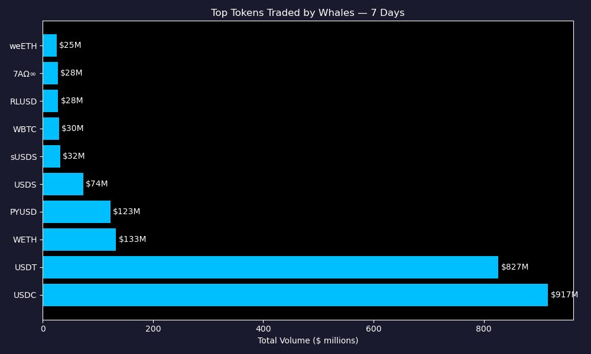

# Ethereum Whale Detection

## Overview
Identification and analysis of whale wallets on Ethereum DEX using real on-chain data 
from Dune Analytics. Analyzed 1,000 largest trades over 7 days (min $100,000 per trade).

## Business Question
Who are the biggest traders on Ethereum DEX and how do they behave?

## Data Source
- Dune Analytics — live Ethereum blockchain data
- 1,000 transactions, all above $100,000
- Period: last 7 days

## Key Findings

### 1. Whale Types
| Wallet | Type | Total Volume | Trades | Avg Trade |
|---|---|---|---|---|
| 0x555f24... | Active Whale | $388M | 81 | $4.8M |
| 0x1f2f10... | Bot / HFT | $355M | 236 | $1.5M |
| 0xbab386... | Mega Whale | $164M | 24 | $6.8M |

### 2. Token Preference
- 87% of volume is stablecoins (USDC + USDT)
- Whales are moving liquidity, not speculating

### 3. Trading Hours
- Peak activity at 16:00 UTC (NYSE open)
- Whales follow traditional market hours — institutional behavior

## Conclusion
Ethereum whale activity is dominated by institutional players and bots.
Monitoring these wallets can provide early signals of large market movements.

## Visualizations

## Tools
Python, Pandas, Matplotlib, Dune Analytics API
